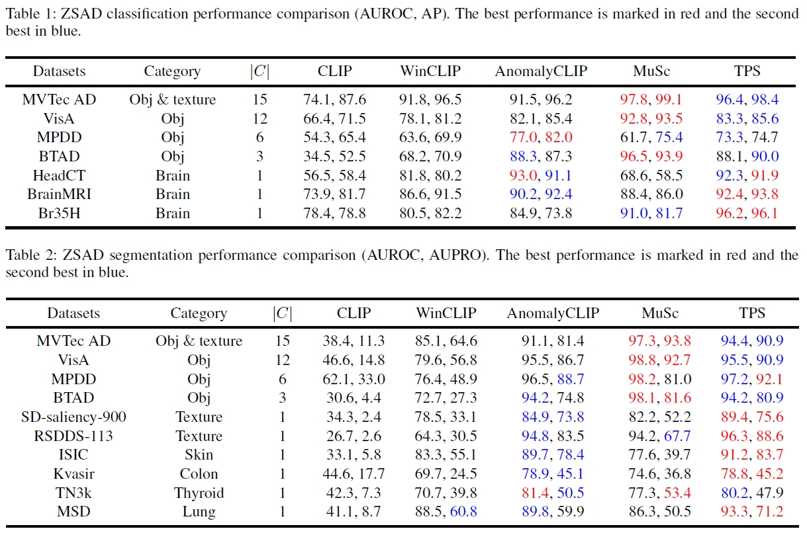
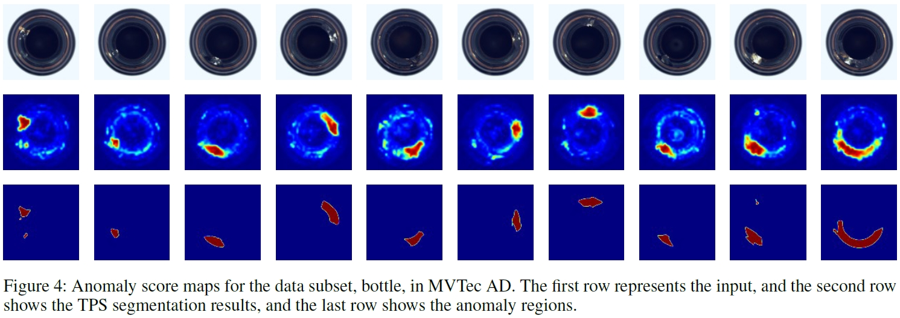
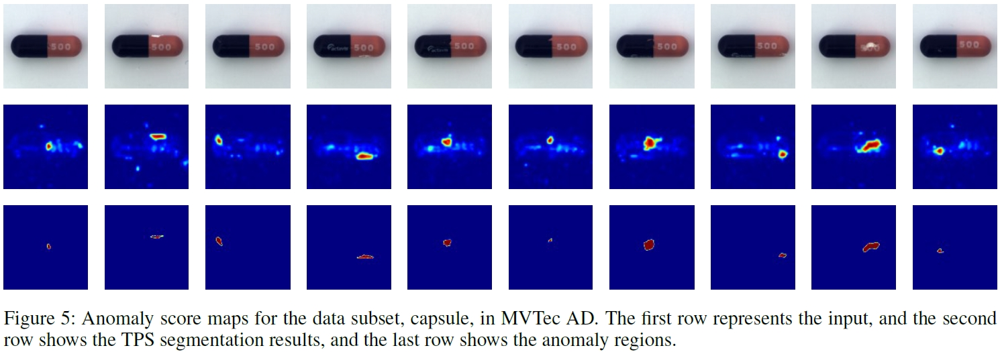
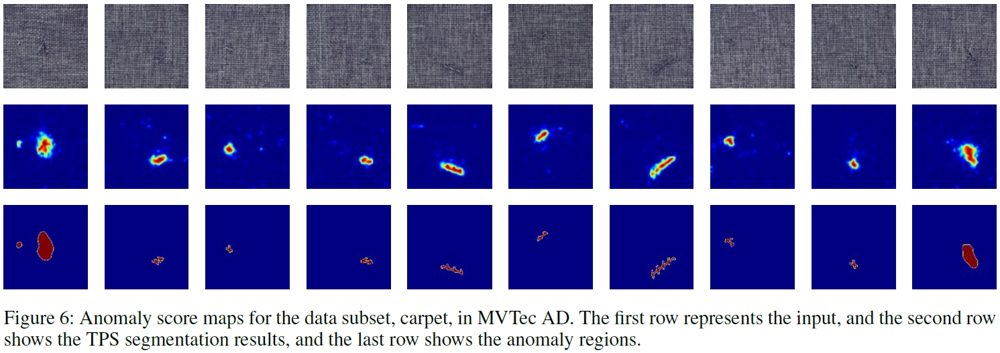
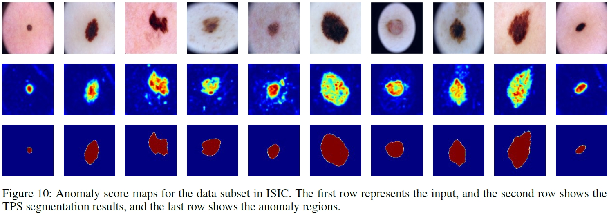
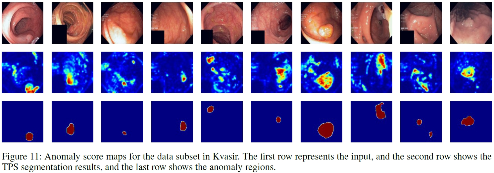
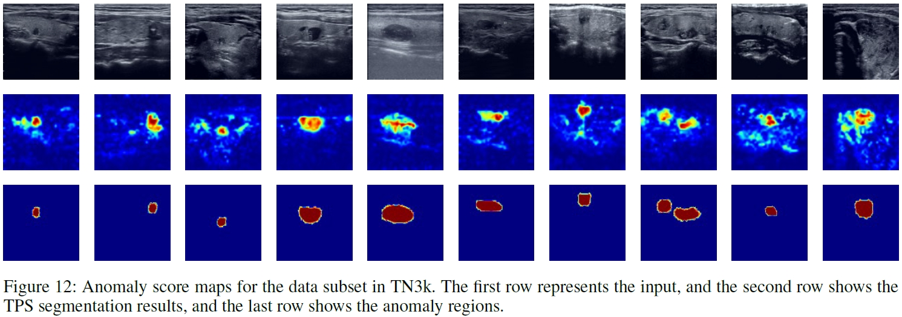

# TPS -- Aligning and Prompting Anything for Zero-Shot Generalized Anomaly Detection (AAAI 2025)
[AAAI 2025] [Camera ready]

by Jitao Ma, Weiying Xie, Hangyu Ye, Daixun Li, Leyuan Fang.

## Introduction
Zero-shot generalized anomaly detection (ZGAD) plays a critical role in industrial automation and health screening. Recent studies have shown that ZGAD methods built on visual-language models (VLMs) like CLIP have excellent cross-domain detection performance. Different from other computer vision tasks, ZGAD needs to jointly optimize both image-level anomaly classification and pixel-level anomaly segmentation tasks for determining whether an image contains anomalies and detecting anomalous parts of an image, respectively, this leads to different granularity of the tasks. However, existing methods ignore this problem, processing these two tasks with one set of broad text prompts used to describe the whole image. This limits CLIP to align textual features with pixel-level visual features and impairs anomaly segmentation performance. Therefore, for precise visual-text alignment, in this paper we propose a novel fine-grained text prompts generation strategy. We then apply the broad text prompts and the generated fine-grained text prompts for visual-textual alignment in classification and segmentation tasks, respectively, accurately capturing normal and anomalous instances in images. We also introduce the Text Prompt Shunt (TPS) model, which performs joint learning by reconstruction the complementary and dependency relationships between the two tasks to enhance anomaly detection performance. This enables our method to focus on fine-grained segmentation of anomalous targets while ensuring accurate anomaly classification, and achieve pixel-level comprehensible CLIP for the first time in the ZGAD task. Extensive experiments on 13 real-world anomaly detection datasets demonstrate that TPS achieves superior ZGAD performance across highly diverse datasets from industrial and medical domains.

## Overview of TPS

## Main results

## BibTex Citation
@inproceedings{ma2025aligning,
  title={Aligning and Prompting Anything for Zero-Shot Generalized Anomaly Detection},
  author={Ma, Jitao and Xie, Weiying and Ye Hangyu and Li, Daixun and Fang, Leyuan},
  booktitle={Proceedings of the AAAI Conference on Artificial Intelligence},
  volume={Camera ready},
  year={2025}
}
